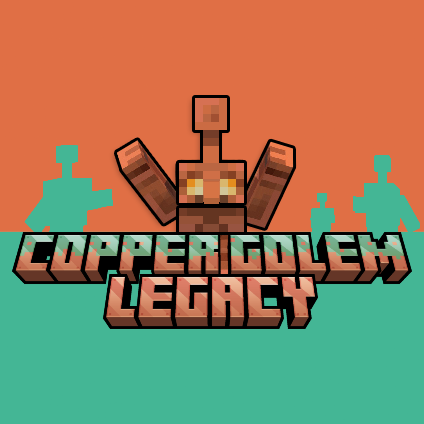

# Copper Golem Legacy

[](https://opensource.org/licenses/MIT)
[](https://www.minecraft.net/)
[](https://neoforged.net/)

[

A Minecraft mod that brings back the Copper Golem from the Minecraft Live 2021 mob vote. This lovable copper companion oxidizes over time, can hold items, press copper buttons, and eventually becomes a statue.

[

## Features

### Copper Golem Entity
- **Natural spawning**: Place a carved pumpkin on a copper block to summon your golem
- **Oxidation system**: Copper golems age through four stages (normal, exposed, weathered, oxidized)
- **Item interactions**: Give items to your golem - they'll store them in their chest and show them off
- **Button pressing**: Golems randomly press copper buttons, acting as natural randomizers
- **Player-oriented spawning**: Golems and their chests face toward you when spawned

### Copper Chest
- **Four oxidation levels**: Copper chests age naturally alongside your golem
- **Double chest support**: Combine two copper chests for double storage
- **Copper-specific sounds**: Each oxidation level has unique opening and closing sounds
- **Waxing support**: Preserve your chest's oxidation level with honeycomb

### Copper Statue
- **Four poses**: Standing, running, sitting, and star pose
- **Interactive**: Right-click with an empty hand to cycle through poses
- **Restoration**: Use an axe to bring oxidized statues back to life as golems
- **Custom sounds**: Unique audio for placing, breaking, and interacting

### Audio Design
- **50+ custom sounds**: Complete sound system for entities, blocks, and interactions
- **Oxidation-specific audio**: Different sounds for each weathering stage
- **Item interaction feedback**: Audio cues when golems pick up, drop, or interact with items

## Spawn
[
- Place a carved pumpkin on a copper block

## Installation

1. Download the latest release from the [Releases](https://github.com/Smallinger/Copper-Golem-Legacy/releases) page
2. Install [NeoForge](https://neoforged.net/) for Minecraft 1.21.1
3. Place the downloaded `.jar` file in your `mods` folder
4. Launch Minecraft and enjoy!

## Building from Source

```bash
# Clone the repository
git clone https://github.com/Smallinger/Copper-Golem-Legacy.git
cd Copper-Golem-Legacy

# Build the mod
.\gradlew build

# The compiled JAR will be in build/libs/
```

## Development

### Requirements
- Java 21 or higher
- Gradle (included via wrapper)
- NeoForge 21.1.215 for Minecraft 1.21.1

### Setup
```bash
# Refresh dependencies
.\gradlew --refresh-dependencies

# Run the client
.\gradlew runClient

# Run the server
.\gradlew runServer
```

## Contributing

Contributions are welcome! Please feel free to submit a Pull Request.

## License

This project is licensed under the MIT License - see the [LICENSE](LICENSE) file for details.

Copyright (c) 2025 Marc Schirrmann

## Credits

- **Author**: Marc Schirrmann (Smallinger)
- **Inspired by**: The Copper Golem from Minecraft Live 2021 mob vote
- **Built with**: [NeoForge](https://neoforged.net/)

## Links

- [GitHub Repository](https://github.com/Smallinger/Copper-Golem-Legacy)
- [Issue Tracker](https://github.com/Smallinger/Copper-Golem-Legacy/issues)
- [Changelog](CHANGELOG.md)

## Support

If you encounter any issues or have questions, please open an issue on the [GitHub issue tracker](https://github.com/Smallinger/Copper-Golem-Legacy/issues).

### Support Development

If you enjoy this mod and would like to support further development, consider buying me a coffee! Your support helps keep the project alive and encourages new features and updates.

[](https://ko-fi.com/smallinger)
